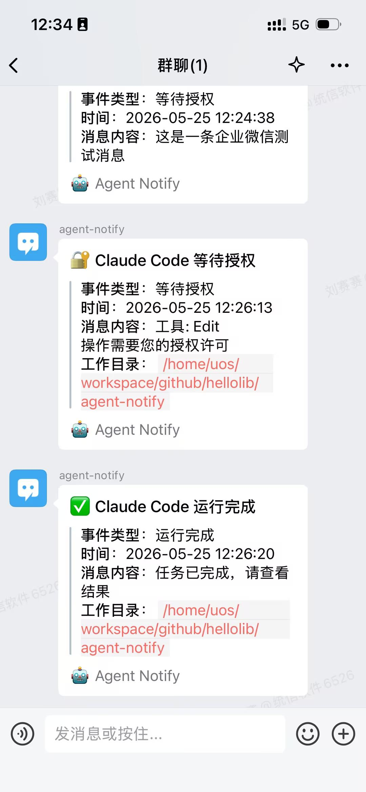

<div align="center">

# Agent Notify

<p align="center"><b>Stop babysitting your AI coding agent.</b><br/>Get pinged on your phone the moment Claude Code needs you — or finishes.</p>

[](https://go.dev/)
[](https://opensource.org/licenses/MIT)
[](https://github.com/hellolib/agent-notify/releases)

<p align="center"><b>English</b> | <a href="README.zh-CN.md">简体中文</a></p>

</div>

## Overview

Agent Notify hooks into the lifecycle events of AI coding agents (Claude Code, Codex, etc.) and pushes them to your phone and desktop. Get notified the moment your agent needs permission, is waiting for input, finishes a task, or fails — so you never have to babysit a running agent.

Supported delivery channels: **OS-native system notifications**, **Feishu/Lark**, **WeChat Work (企业微信)**, **DingTalk (钉钉)**, **Bark (iOS)**, and **ntfy**.

## Features

### Supported Channel

| Channel | Description | Setup   |
|:--------|------|---------|
| 🖥️ System Notification | Native notifications on macOS, Linux, and Windows | Default |
|  Feishu / Lark | One-click QR-code binding; push via Feishu bot messages | QR scan |
|  WeChat Work | Push notifications via a WeChat Work group bot webhook | Webhook |
|  DingTalk | Push notifications via a DingTalk group bot webhook | Webhook |
|  Bark | Push to iOS devices via a Bark webhook URL | Webhook |
|  ntfy | Push via ntfy.sh or self-hosted ntfy server; | Topic |
|  Slack | Push via Slack Incoming Webhook | Webhook |
|  Discord | Push via Discord channel webhook | 🚧 Webhook |
|  Telegram | Push via Telegram Bot API | 🚧 Bot token |

### Supported Events

| Event | Description | Claude Code | Codex |
|------|------|:---:|:---:|
| `permission_required` | Agent needs authorization (e.g. to run a command) | ✅ | ✅ |
| `input_required` | Agent is waiting for user input | ✅ | — |
| `run_completed` | Task finished | ✅ | ✅ |
| `run_failed` | Task failed | ✅ | — |

Notes:

- Claude Code subscribes to all four events via hooks in `~/.claude/settings.json` (`PermissionRequest`, `Notification`, `Stop`, `PostToolUseFailure`).
- Codex subscribes to `PermissionRequest` and `Stop` via `~/.codex/hooks.json`, mapped to `permission_required` and `run_completed` respectively. `input_required` and `run_failed` have no corresponding Codex hook yet, so they are not supported.

### Supported Platforms

| Platform | Architecture | Status |
|:---:|:---:|:---:|
| macOS | amd64 / arm64 | ✅ |
| Linux | amd64 / arm64 | ✅ |
| Windows | amd64 | ✅ |

## Quick Start

```bash
npx agent-notify
```

On first run, the launcher downloads the platform-specific binary matching the current npm package version from GitHub Releases and installs it to:

- macOS / Linux: `~/.agent-notify/agent-notify`
- Windows: `~/.agent-notify/agent-notify.exe`

On every subsequent run it checks the local binary version: it downloads if missing, updates if outdated, and otherwise runs directly. The launcher never persistently modifies `PATH` — it always executes via an absolute path.

> **Note**: Codex integrates through the official hooks system in `~/.codex/hooks.json` and currently subscribes only to `PermissionRequest` and `Stop`. After first install, run `/hooks` inside Codex to complete the trust review.

## Configuration

> You don't need to edit config files by hand — this section is for reference only.

Agent Notify's own config lives at `~/.agent-notify/config.yaml`. Agent integration config locations:

- Claude Code: `~/.claude/settings.json` (writes hooks → command `agent-notify handle-claude-hook`)
- Codex: `~/.codex/hooks.json` (writes hooks → command `agent-notify handle-codex-hook`; run `/hooks` inside Codex to complete trust)

### WeChat Work Bot Binding Tip

1. **Create a single-person notification group**: start a group chat in WeChat Work (pull in a few colleagues). After it's created, **do not post anything**, then remove the others — the group becomes your personal notification channel.
2. **Add a bot**: "Group Settings" → "Message Push" → "Add" → "Custom Message Push", name it and save.
3. **Get the webhook URL**: copy the generated URL, which looks like `https://qyapi.weixin.qq.com/cgi-bin/webhook/send?key=xxx`.
4. **Bind it**: run `npx agent-notify`, enable the WeChat Work channel in the setup wizard, and paste the webhook URL.
> Older WeChat Work versions: "Group Settings" → "Group Bots" → "Add Bot" → "New Bot", name it and save.

### Bark Setup

1. **Copy the Bark URL**: in the Bark app, copy the test URL, e.g. `https://api.day.app/<key>/your-push-content`.
2. **Bind it**: run `npx agent-notify`, go to "Channel Config" → "Init Bark", and paste the Bark URL.
3. **Codex completion notifications**: in `~/.agent-notify/config.yaml`, keep Codex's `run_completed` event and enable `notify.codex.channels.bark`.

The Bark URL is saved as local config; notifications are sent using Bark's POST JSON parameters `title` and `body`.

## Workflow

<p align="center">
  
</p>

## Screenshots

| |                                                              |
|:---:|:------------------------------------------------------------:|
|  |     |
| **Setup** |                           **Feishu Binding**                           |
|  |  |
| **Feishu Notification** |                          **WeChat Work Notification**                          |
|  |                                                              |
| **System Notification** |                                                              |

## Friendship Link

Thanks for the support and feedback from the friends at [LINUX DO](https://linux.do/).

## ❤️ Sponsor

Thanks to **[DDS (呆呆兽)](https://www.ddshub.cc/register?aff=E7N6PDYWW4N5)** for sponsoring this project! DDS is a reliable, high-performance Claude and Codex API relay, offering cost-effective, accelerated Claude / Codex API access in China for both individuals and enterprises. It supports full-strength models including Claude Haiku / Opus / Sonnet, and enterprise customers can enjoy customized groupings and technical support.
